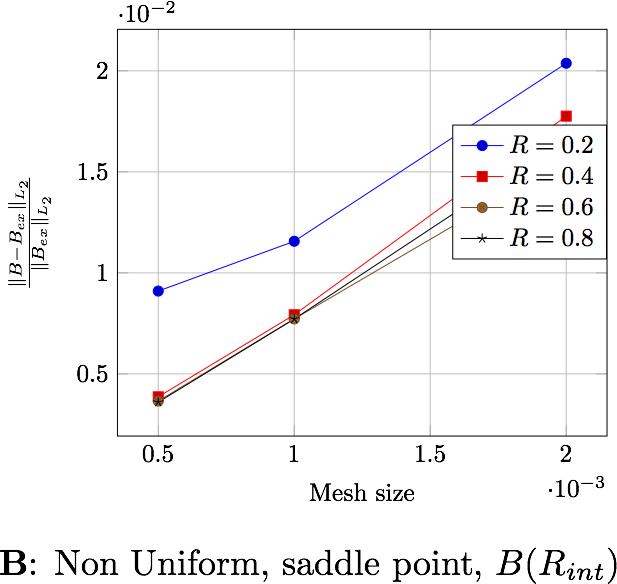
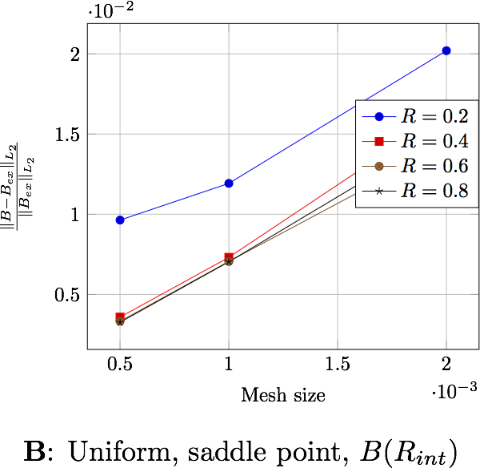

Torus Benchmark
===============
:author: Romain Hild <hild.romain@gmail.com>
:toc:
:toc-placement: preamble
:toclevels: 1
:biblio: ../../Appendix/Bibliography/readme.adoc 

We need to verify our implementation against physical configuration, we choose to compute the potential vector and the magnetic flux of a torus. This is an axisymmettric configuration and we will work on a quarter of it.

== Description 

We want to resolve the Maxwell's equations presented in link:Maxwell.adox[Maxwell] and compare them with some exact solutions given by C. Trophime using Bmap.

> **TODO** references for solutions and bmap

The condition $$\mathbf{A}\times\mathbf{n}=0$$ on $$\partial\Omega$$ must be set at the infinity, which is computationally impossible. So we create a sphere around our region of interest to simulate the infinity. This restriction induces an error. +
The goal here is to see the influence of the radius of the external sphere on the results.

The following figure presents the geometry used. The left part represents a side view, and the right part, an upside view. +
image:TorusViews.png[alt=""]
image:quartTorus.png[width=500] +
$$\Omega=\Omega_c\cup\Omega_n\cup\Omega_f$$ where $$\Omega_c$$ is the coil, $$\Omega_n$$ the domain near the coil, where the mesh is thin, $$\Omega_f$$ where the mesh is coarse. $$\partial\Omega=\Gamma_s\cup\Gamma_\infty$$ where $$\Gamma_\infty$$ represents the infinity, we can change $$R_\infty$$ to study its influence on the results, and $$\Gamma_s$$ is the boundary due to the symmetry.

=== Boundary conditions 

We set

* on $$\Gamma_\infty$$, we chose our potential vector to be null:
$$
  \mathbf{A}\times\mathbf{n} = 0
$$
* on $$\Gamma_s$$, due to the symmetry of the geometry, we have also:
$$
  \mathbf{A}\times\mathbf{n} = 0
$$
* and in the saddle-point case, on $$\partial\Omega$$,
$$
  p = 0
$$

== Inputs

- Parameter set definition 

We impose the electric current on the coil, $$\Omega_c$$. We use two different current, an uniform electric current $$J_1$$, and a non uniform current $$J_2$$.

.Fixed and Variable Input Parameters
|===
| Name |Description | Nominal Value | Range | Units

|$$J_1$$ | uniform electric current | $$\frac{12.10^{6}}{\pi\sqrt{x^2+y^2} }\begin{pmatrix} -y\\ x\\ 0 \end{pmatrix}$$ | | $$\frac{A}{m^2}$$ 
|$$J_2$$ | non uniform electric current | $$\frac{12.10e{^6}}{\pi\left(x^2+y^2\right)}\begin{pmatrix} -y\\ x\\ 0 \end{pmatrix}$$ | | $$\frac{A}{m^2}$$ 
|$$R$$ | external radius | | $$[0.2:0.2:0.8]$$ |$$m$$
|===

- Solver and preconditioner used

The solver and preconditionner are the ones detail in link:../Strategy.adoc[Resolution Strategy]

== Outputs

Two metrics are of interests, the relative error on the potential
$$
  \frac{||\mathbf{A}-\mathbf{A}_{ex}||_{L_2}}{||\mathbf{A}_{ex}||_{L_2}}
$$
and the relative error on the magnetic flux
$$
  \frac{||\mathbf{B}-\mathbf{B}_{ex}||_{L_2}}{||\mathbf{B}_{ex}||_{L_2}}
$$

These errors can be computed either in the whole domain, $$\Omega$$, either in a ball inside of the region of interest, $$B(R_{int})$$, that is, inside the torus (in our case $$R_{int}=0.0306$$) +
In a physical point of view, the later is more natural because this is where we need to know what happens.

== Discretization

We use differents size for the external sphere's *Radius*, $$0.2,0.4,0.6,0.8$$, and different characteristic *size* for the mesh. Which give the following problems' sizes, in terms of degrees of freedom for *Nedelec* elements, *Lagrange* elements and number of *Elements*.

.Size of the problems
[width="75%",cols="^,^,^,^,^",options="header"]
|===
| Radius | Size  | Nedelec | Lagrange | Elements
| 0.2     | 0.002 | 30 274   | 4 829     | 26 819
| 0.2     | 0.001 | 175 918  | 26 830    | 153 811
| 0.2    | 0.0005| 1 295 463 | 190 138   | 1 123 817
| 0.4    | 0.002 | 30 335   | 4 850     | 27 046
| 0.4    | 0.001 | 185 351  | 28 157    | 162 558
| 0.4    | 0.0005| 1 340 051 | 197 203   | 1 163 839
| 0.6    | 0.002 | 31 409   | 5 126     | 28 026
| 0.6    | 0.001 | 196 658  | 30 044    | 172 901
| 0.6    | 0.0005| 1 436 732 | 212 077   | 1 249 418
| 0.8    | 0.002 | 35 006   | 5 692     | 31 428
| 0.8    | 0.001 | 215 315  | 33 094    | 189 770
| 0.8    | 0.0005| 1 558 174 | 230 775   | 1 356 968
|===

== Implementation 

The implementation can be found in  link:https://github.com/feelpp/solodem/blob/9f33195bb24d418fb3cee6e959784803c9c2898e/src/TorusQuart[here].

//You need to have the files containing the exact solution for $$\mathbf{A}$$ and $$\mathbf{B}$$. Then, you need to

//. use link:https://github.com/feelpp/solodem/blob/9f33195bb24d418fb3cee6e959784803c9c2898e/src/TorusQuart/compareCecileVincent.sh[compareCecileVincent.sh] to generate the file containing the potential for the different currents, radius, meshes and formulations. +
//. use link:https://github.com/feelpp/solodem/blob/9f33195bb24d418fb3cee6e959784803c9c2898e/src/TorusQuart/analyse.sh[analyse.sh] to generate the different metrics for each case.
//. use link:https://github.com/feelpp/solodem/blob/9f33195bb24d418fb3cee6e959784803c9c2898e/src/TorusQuart/parseCompareCecileVincent.sh[parseCompareCecileVincent.sh] to generate the csv files for each case.

== Results

=== Potential vector

The regularized formulation does not make sense for the potential, since it is known up to a gradient. +
The following figures present the errors depending on the current and the domain in which the error is computed. Each figure shows the error depending on the mesh size for the differents external radius $$R_\infty$$. The two first figures exhibit the behavior of the saddle point formulation, whereas the last two, exhibit the regularized formulation.

image:TorusGraph/ANuniSaddO.png[width=300] 
image:TorusGraph/ANuniSaddR.png[width=300]
image:TorusGraph/AUniSaddO.png[width=300]
image:TorusGraph/AUniSaddR.png[width=300]

=== Magnetic flux

The following table presents the errors for the non-uniform current depending on the formulation and the domain in which the error is computed. Each figure shows the error depending on the mesh size for the differents external radius $$R_\infty$$. The two first figures exhibit the behavior of the saddle point formulation, whereas the last two, exhibit the regularized formulation.

image:TorusGraph/BNuniSaddO.png[width=300]

image:TorusGraph/BNuniStabO.png[width=300]
image:TorusGraph/BNuniStabR.png[width=300]

The following table presents the errors for the uniform current depending on the formulation and the domain in which the error is computed. Each figure shows the error depending on the mesh size for the differents external radius $$R_\infty$$. The two first figures exhibit the behavior of the saddle point formulation, whereas the last two, exhibit the regularized formulation.

image:TorusGraph/BUniSaddO.png[width=300]

image:TorusGraph/BUniStabO.png[width=300]
image:TorusGraph/BUniStabR.png[width=300]

== Conclusion

We can extract here some results:

- the formulation or the type of current has no influence on the results,
- the difference between the errors computed in $$\Omega$$ and in $$B(R_{int})$$, a factor 4 for $$\mathbf{B}$$ and 10 for $$\mathbf{A}$$, shows that the errors occure in particular in $$\Omega_f$$. This is due to the approximation on the boundary condition on $$\Gamma_\infty$$,
- the distance $$R_\infty$$ allows to have better approximations as it grows, until it reachs a certain bound, between $$0.4$$ and $$0.6$$ depending on the characteristic size of the mesh
