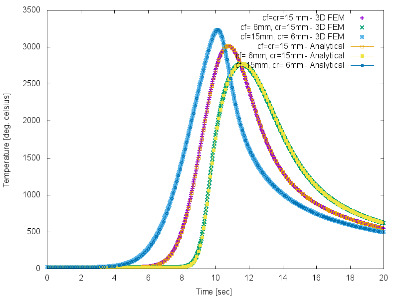
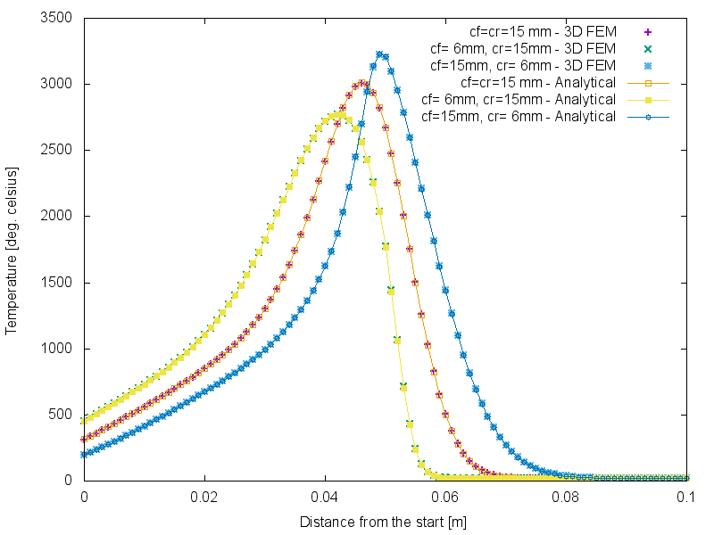

3D Benchmark - Moving heat source
=================================
:toc:
:toc-placement: preamble
:toclevels: 1
:biblio: ../../Appendix/Bibliography/readme.adoc 

Simulations of welding process require accurate and reliable heat repartition evaluations.

In the welding process, the heat source is moving.

link:{biblio}#CNM:CNM1324[Fachinotti & al.] proposed an analytical solution of the non steady linear heat equation in a semi infinite body with the input source given by link:{biblio}#1984_goldak[Goldak et al.].

## Physical parameters
|===
| Symbol | Name | Unit
| $$\rho$$ | density | $$\frac{[kg]}{[m^3]}$$
| $$c$$ | heat capacity | $$\frac{[J]}{[K]}$$
| $$q$$ | heat source | x
| $$k$$ | thermal conductivity | $$\frac{[W]}{[m.K]}$$
| $$K=\frac{k}{\rho c}$$ | thermal diffusivity | $$\frac{[m^2]}{[s]}$$
| $$T=T(x,y,z,t)$$ | Temperature at time $$t$$ and position $$(x,y,z)$$ | $$[K]$$
| $$T_0=T_0(x,y,z)$$ | Initial temperature at position $$(x,y,z)$$ | $$[K]$$
|===

## Temperature field

Heat conduction in a homogeneous solid is governed by the linear partial differential equation:
$$
\rho c \partial_t T - k \Delta T = q
$$
endowed with initial and boundary condition.

In the following, we will considere infinite body. That is if the computational domain is big enough, we will set $$T_0$$ as a boundary condition.

## Moving double ellipsoidal heat source

Consider a fixed Cartesian reference frame $$(x,y,z)$$, in which a heat source located initially at $$z=0$$ and at time $$t=0$$, moves with constant velocity, $$v$$, along the $$z$$-axis. 
In the case of welding applications, link:{biblio}#1984_goldak[Goldak et al.] defined the heat source at a position $$(x,y,z)$$ and time, $$t$$, by means of the following double-ellipsoidal distribution:

$$
q(x,y,z,t) = \frac{6 \sqrt{3}Q}{\pi \sqrt{\pi}ab} \times 
\begin{cases}
    \frac{f_f}{c_f} \exp\left[-3 \frac{x^2}{a^2}-3 \frac{y^2}{b^2}-3 \frac{\left(z-vt\right)^2}{c_f^2}\right], & \text{for $z>vt$}.\\
    \frac{f_r}{c_r} \exp\left[-3 \frac{x^2}{a^2}-3 \frac{y^2}{b^2}-3 \frac{\left(z-vt\right)^2}{c_r^2}\right], & \text{for $z<vt$}.
  \end{cases}
$$

where $$._f$$ stands for *front* and $$._r$$ stands for *rear*.

[[double_ellispoidal]]
.Double Ellipsoidal Heat source model - link:{biblio}#CNM:CNM1324[source]
image::double_ellispoidal_heat_source_model.png[alt="Double Ellipsoidal Heat source model",align="center"]

## Analytical solution

Given the linear equation and the heat source, we have (see link:{biblio}#CNM:CNM1324[Fachinotti & al.]) the following analytical solution:

$$
\begin{aligned}
T\left(x,y,z,t\right) &= T0 + \frac{3\sqrt{3} Q }{\pi\sqrt{\pi} \rho c} \times \int_{0}^{t} \frac{\exp\left[-3 \frac{x^2}{12 K \left(t-t'\right) + a^2}-3 \frac{y^2}{12 K \left(t-t'\right) + b^2}\right]}{\sqrt{12 K \left(t-t'\right) + a^2}\sqrt{12 K \left(t-t'\right) + b^2}} \\
&= \times \left[ f_r A_r \left(1-B_r\right) + f_f A_f \left(1-B_f\right)\right] \mathrm{d}t'
\end{aligned}
$$
with - using $$i=r$$ or $$f$$:
$$
A_i = A(z,t,t'; c_i) = \frac{\exp\left[-3 \frac{\left(z-vt'\right)^2}{12 K \left(t-t'\right) + c_i^2}\right]}{\sqrt{12 K \left(t-t'\right) + c_i^2}}
$$
and
$$
B_i = B(z,t,t'; c_i) = \text{erf}\left[\frac{c_i}{2}\frac{z-vt'}{\sqrt{K\left(t-t'\right)}\sqrt{12 K \left(t-t'\right) + c_i^2}}\right]
$$

## Comparison

We evaluate the temperature field at $$(0,0,0.05)$$ over the time and compare it with the analytical solution.
That is actually the reproduction (3D only) of the figure 7 in link:{biblio}#CNM:CNM1324[Fachinotti & al.]

We also evaluate the temperature profile along the welding path, 10s after the start of the simulation.
That is actually the reproduction (3D only) of the figure 8 in link:{biblio}#CNM:CNM1324[Fachinotti & al.]

https://www.youtube.com/watch?v=31nQtOMwDLQ
