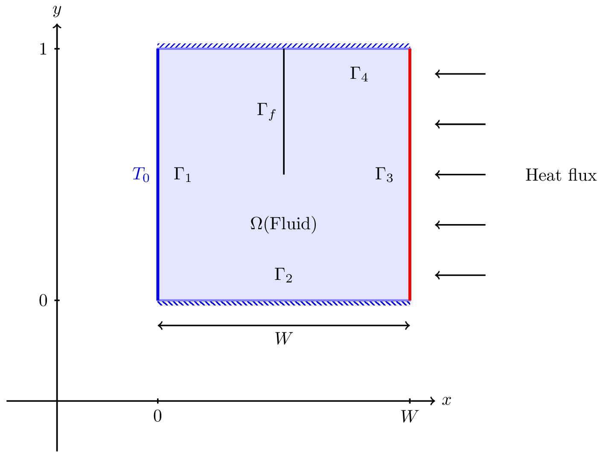

Natural Convection in a Cavity
==============================

This is a standard benchmark with many data available. 

[[sec:description]]
== Description

The goal of this project is to simulate the fluid flow under natural
convection: the heated fluid circulates towards the low temperature
under the action of density and gravity differences. The phenomenon is
important, in the sense it models evacuation of heat, generated by
friction forces for example, with a cooling fluid.

We shall put in place a simple convection problem in order to study the
phenomenon without having to handle the difficulties of more complex
domaines. We describe then some necessary transformations to the
equations, then we define quantities of interest to be able to compare
the simulations with different parameter values.

== Geometry

[[fig:heatns:1]]

To study the convection, we use a model problem: it consists in a
rectangular tank of height $$1$$ and width $$W$$, in
which the fluid is enclosed, see figure <<fig:heatns:1>>. We wish to know
the fluid velocity $$\mathbf{u}$$, the fluid pressure
$$p$$ and fluid temperature $$\theta$$.

We introduce the adimensionalized Navier-Stokes and heat equations
parametrized by the Grashof and Prandtl numbers. These parameters allow
to describe the various regimes of the fluid flow and heat transfer in
the tank when varying them.

The adimensionalized steady incompressible Navier-Stokes equations
reads: 

$$
\begin{split}
    \mathbf{u}\cdot\nabla \mathbf{u} + \nabla p -
    \frac{1}{\sqrt{\text{Gr}}} \Delta \mathbf{u} 
    &= \theta \mathbf{e}_2 \\
    \nabla \cdot \mathbf{u} &= 0\ \text{sur}\ \Omega\\
    \mathbf{u} &= \mathbf{0}\ \text{sur}\ \partial \Omega
\end{split}
$$

where $$\mathrm{Gr}$$ is the Grashof number, $$\mathbf{u}$$ the
adimensionalized velocity and $$p$$ adimensionalized pressure and
$$\theta$$ the adimensionalized temperature. The temperature is in
fact the difference between the temperature in the tank and the
temperature $$T_0$$ on boundary $$\Gamma_1$$.

The heat equation reads:

$$
\begin{split}
  \mathbf{u} \cdot \nabla \theta -\frac{1}{\sqrt{\text{Gr}}{\mathrm{Pr}}} \Delta \theta &= 0\\
  \theta &= 0\ \text{sur}\ \Gamma_1\\
  \frac{\partial \theta}{\partial n} &= 0\ \text{sur}\ \Gamma_{2,4}\\
  \frac{\partial \theta}{\partial n} &= 1\ \text{sur}\ \Gamma_3
\end{split}
$$

where $$\mathrm{Pr}$$ is the Prandtl number.

[[sec:infl-des-param]]
== Influence of parameters

what are the effects of the Grashof and Prandtl numbers ? We remark that
both terms with these parameters appear in front of the
$$\Delta$$ parameter, they thus act on the diffusive terms. If
we increase the Grashof number or the Prandtl number the coefficients
multiplying the diffusive terms decrease, and this the convection, that
is to say the transport of the heat via the fluid, becomes dominant.
This leads also to a more difficult and complex flows to simulate, see
figure [fig:heatns:2]. The influence of the Grashof and Prandtl numbers
are different but they generate similar difficulties and flow
configurations. Thus we look only here at the influence of the Grashof
number which shall vary in $$[1, 1e7]$$.

image::flow_grashof.png[caption="Figure 2", title="Velocity norm with respect to Grashof",width="500", align="center"]

[[sec:quant-du-benchm]]
== Quantities of interest

We would like to compare the results of many simulations with respect to
the Grashof defined in the previous section. We introduce two quantities
which will allow us to observe the behavior of the flow and heat
transfer.

[[sec:mean-temperature]]
=== Mean temperature

We consider first the mean temperature on boundary
$$\Gamma_3$$

$$
T_3 = \int_{\Gamma_3} \theta
$$

This quantity should decrease with increasing Grashof because the fluid
flows faster and will transport more heat which will cool down the
heated boundary $$\Gamma_3$$. We observe this behavior on the
figure <<fig:heatns:3>>.

[[fig:heatns:3]]
image::temp_grashof.png[Mean temperature with respect to the Grashof number]

[[sec:flow-rate]]
=== Flow rate

Another quantity of interest is the flow rate through the middle of the
tank. We define a segment $$\Gamma_f$$ as being the vertical
top semi-segment located at $$W/2$$ with height
$$1/2$$, see figure [fig:heatns:1]. The flow rate, denoted
$$\mathrm{D}_f$$, reads
$$
  \mathrm{D}_f =  \int_{\Gamma_f} \mathbf{u} \cdot \mathbf{e}_1
$$

where
$$\mathbf{e}_1=(1,0)$$. Note that the flow rate can be
negative or positive depending on the direction in which the fluid
flows.

As a function of the Grashof, we shall see a increase in the flow rate.
This is true for small Grashof, but starting at $$1e3$$ the
flow rate decreases. The fluid is contained in a boundary layer which is
becoming smaller as the Grashof increases.

image::debit_grashof.png[Behavior of the flow rate with respect to the Grashof
number; $$h = 0.02$$, $$\mathbb{P}_3$$ for the velocity, $$\mathbb{P}_2$$ for
the pressure and $$\mathbb{P}_1$$ for the temperature.]

== Running the model

[source,sh]
----
$ mpirun -np 4 /usr/local/bin/feelpp_toolbox_fluid_2d --config-file cfd2d.cfg
----
