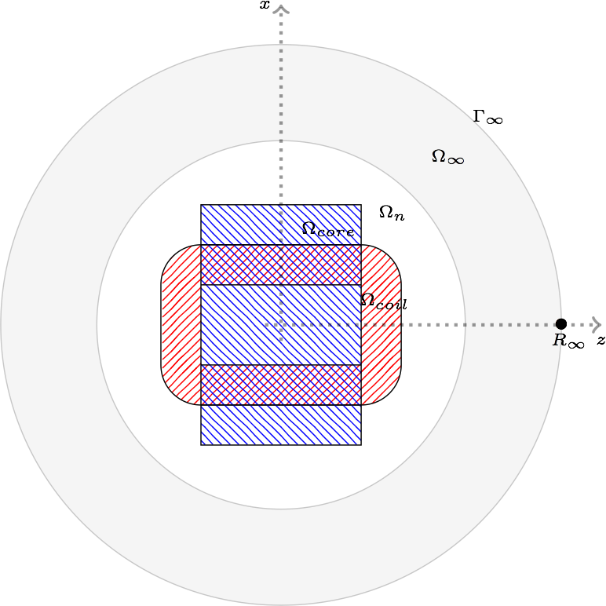
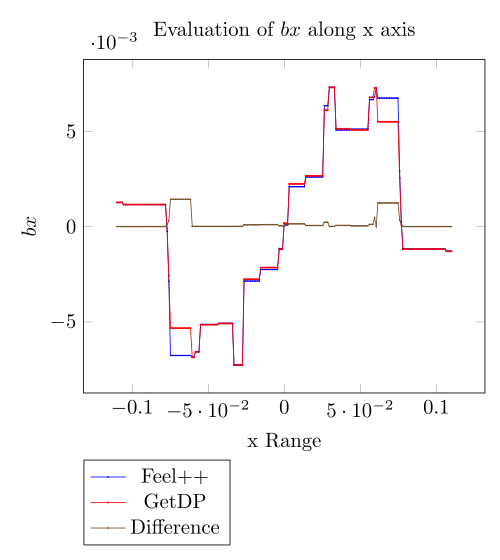
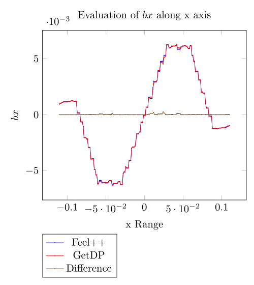
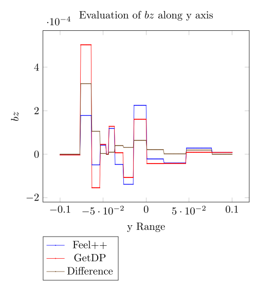
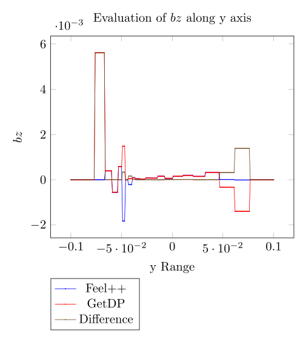
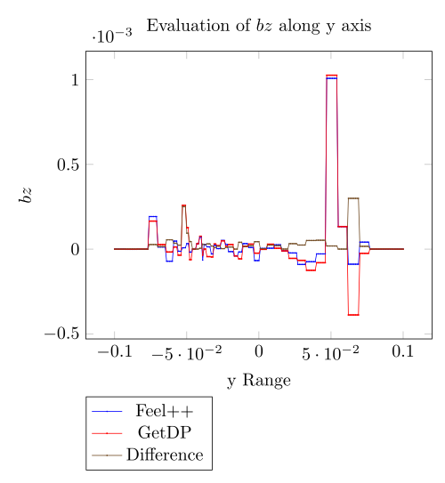
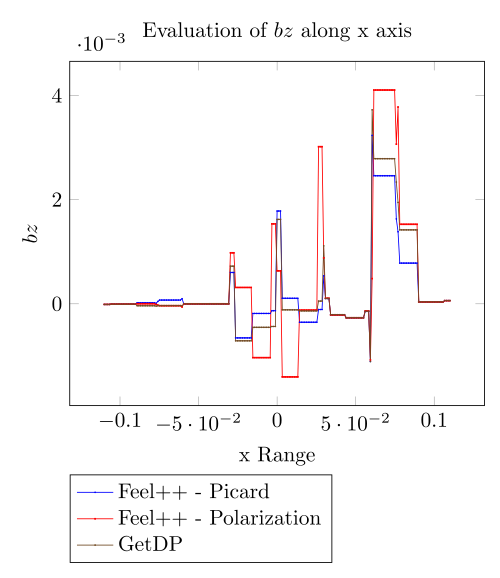
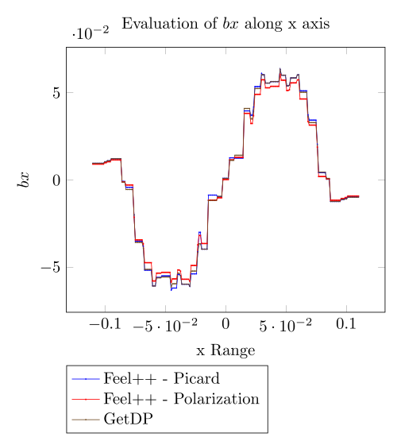
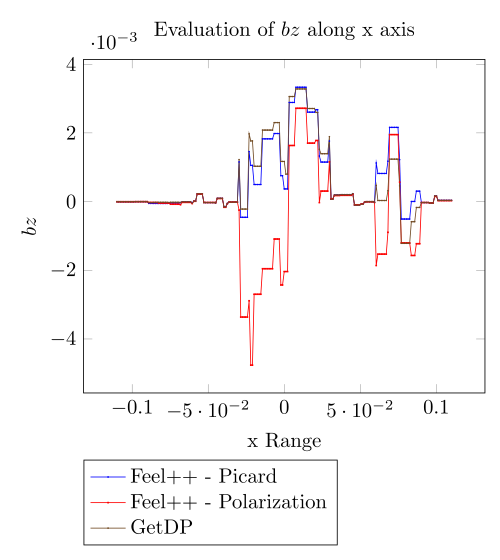

Inductor Benchmark
==================
:author: Romain Hild <hild.romain@gmail.com>, Vincent HUBER <vincent.huber@cemosis.fr>
:toc:
:toc-placement: preamble
:toclevels: 1
:biblio: ../../Appendix/Bibliography/readme.adoc 

We now want to compare our implementation with another one, written with the  link:http://getdp.info/[GetDP] solver, by P. Dular and C. Geuzaine. 
For this, we will use the example of the link:http://onelab.info/wiki/Inductor[Inductor].

== Description

=== Geometry

The experience consist on an inductor that generates a magnetic field.
This inductor is surrounded by two cores, themselves seperated by a thin space of air.
The two cores and the inductor are intermingle like this:

image::CoilCore.png[alt="Coil and Cores", title="A mesh of the domain", align="center", width="400"]

As in the link:../Torus/readme.adoc[torus] benchmark, we encompass this set by a sphere representing the air until the infinity.

|===
Front View
image:InductorXY.png[alt="View XY", title="Front view", align="center", width="400"] |
Top View

|===

$$\Omega=\Omega_{core}\cup\Omega_{coil}\cup\Omega_n\cup\Omega_\infty$$ where $$\Omega_n$$ corresponds to the thin mesh near the coil, $$\Omega_\infty$$ the coarse mesh far away and  $$\Gamma_\infty$$ the approximation of the infinity.

=== Magnetic permeability

Two kinds of experiments are done here: linear and non linear.

==== Linear

For the linear case, the relative magnetic permeability is piecewise constant.
We have chosen to set it to $$2 000$$ in the cores, and $$1$$ everywhere else.

==== Non linear

For the non linear case, the relative magnetic permeability is set to $$1$$ everywhere exept on the cores.
We uses there the following law that is given with a set of points.
We use extrapolation to extend the magnetic permeability when $$\mathbf{H}$$ goes to infinity.
The interpolation is done with the Akima's one.

[[bh_curve]]
image::BH.png[width="300", align="center", title="$$B-H$$ curve given in the source code of the benchmark"]

=== Boundary conditions

We set 

- on $$\Gamma_\infty$$, we chose our potential vector to be null:
$$
  \mathbf{A}\times\mathbf{n} = 0
$$

== Inputs

The source term - $$\mathbf{J}$$ - is given with an analytical expression scalled with the coil properties to mimic a constant field in the inductor.

We decompose $$\Omega_{Coil}$$ in a partition of eight parts defined :

.Decomposition of $$\Omega_{Coil}$$
|===
|               | $$x$$ | $$z$$ 
| $$\Omega_{1}$$| $$ x < w_{E}~AND~x > -w_{E} $$ | $$z > \frac{Lz}{2} $$ 
| $$\Omega_{2}$$| $$ x < w_{E}~AND~x > -w_{E} $$| $$z < \frac{Lz}{2} $$
| $$\Omega_{3}$$| $$x>w_{E}$$| $$ z < \frac{Lz}{2}~AND~x > -\frac{Lz}{2} $$
| $$\Omega_{4}$$| $$x<-w_{E}$$ | $$ z < \frac{Lz}{2}~AND~x > -\frac{Lz}{2} $$ 
| $$\Omega_{5}$$| $$x>w_{E}$$ | $$z>\frac{Lz}{2}$$
| $$\Omega_{6}$$| $$x>w_{E}$$ | $$z<-\frac{Lz}{2}$$
| $$\Omega_{7}$$| $$x<-w_{E}$$| $$z>\frac{Lz}{2}$$
| $$\Omega_{8}$$| $$x<-w_{E}$$| $$z<-\frac{Lz}{2}$$
|===

Thus, the right hand side reads:

$$
\begin{align}
\mathbf{J}&=\frac{-nW}{s}
\left(
\left.
\begin{pmatrix}
1 \\ 0 \\ 0
\end{pmatrix}\right|_{\Omega_1}
+
\left.
\begin{pmatrix}
-1 \\ 0 \\ 0
\end{pmatrix}\right|_{\Omega_2}
+
\left.
\begin{pmatrix}
0 \\ 0 \\ -1
\end{pmatrix}\right|_{\Omega_3}
+
\left.
\begin{pmatrix}
0 \\ 0 \\ 1
\end{pmatrix}\right|_{\Omega_4}
\right.\\&+\left.
\left.
\begin{pmatrix}
\sin\left(\rm atan2\left(z-\frac{Lz}{2},x-w_{E}\right)\right) \\ 0 \\ -\cos\left(\rm atan2\left(z-\frac{Lz}{2},x-w_{E}\right)\right)
\end{pmatrix}\right|_{\Omega_5}
\right.\\&+\left.
+
\left.
\begin{pmatrix}
\sin\left(\rm atan2\left(z+\frac{Lz}{2},x-w_{E}\right)\right) \\ 0 \\ -\cos\left(\rm atan2\left(z+\frac{Lz}{2},x-w_{E}\right)\right)
\end{pmatrix}\right|_{\Omega_6}
\right.\\&+\left.
+
\left.
\begin{pmatrix}
\sin\left(\rm atan2\left(z-\frac{Lz}{2},x+w_{E}\right)\right) \\ 0 \\ -\cos\left(\rm atan2\left(z-\frac{Lz}{2},x+w_{E}\right)\right)
\end{pmatrix}\right|_{\Omega_7}
\right.\\&+\left.
+
\left.
\begin{pmatrix}
\sin\left(\rm atan2\left(z+\frac{Lz}{2},x-w_{E}\right)\right) \\ 0 \\ -\cos\left(\rm atan2\left(z+\frac{Lz}{2},x-w_{E}\right)\right)
\end{pmatrix}\right|_{\Omega_8}
\right)
\end{align}
$$
where $$w_{E}$$ is the height of the coil, $$Lz$$ the, $$Nw$$ the number of turns and $$s$$ the section of the coil.

We have run the benchmark with the following parameters:

.Parameters
[width="50%",cols=">s,^m",frame="topbot", align="center"]
|===
| $$\mu_r(\Omega_{Core})$$ | 2000
| $$\mu_r(\Omega \backslash \Omega_{core} )$$ | 1
| Current | 1
| Number of turns | 288
|===

The geometry embed the air gap in the Core and we do not use the shell transformation to infinity.

== Outputs

We have chose to compare the flux and the magnetic energy.
The flux is defined as:
$$
F = \frac{1}{2}\int_{\Omega_{coil}}\mathbf{J} \cdot \mathbf{A}
$$
The magnetic energy is defined as:
$$
M = \frac{1}{2}\int_{\Omega} \mathbf{B} \cdot \mathbf{H}
$$

== Discretization

.Mesh characteristics
[cols=">s,^e,^e,^e,^e,^e,^e",frame="topbot",options="header"]
|===
| Mesh id | Number of elements | Linear system size (Feel++) | Size $$A$$ | size $$p$$ | Size GetDP | Linear system size ratio 
| Mesh 1 | 21 739 | 25 720 | 22 517| 3 203 | 19 249 | 1.33 
| Mesh 2 | 89 749 | 119 348	|104 663	|14 685 | 89 521 | 1.3 
| Mesh 3 | 572 207| 706 192	| 620544	|85 648 | 533 161| 1.27 
|===
The difference between size of $$\mathbf{A}$$ and getDp can come from the duplicates elements in the mesh that Feel++ does not ignore at run time.

== Results

=== Linear simulations

.Magnetic energy
[cols=">s,^e,^e,^e",frame="topbot",options="header"]
|===
|   | Mesh 1 | Mesh 2 | mesh 3 
| GetDP  | 0.0638797   | 0.0661257   | 0.0672932  
| Feel++ | 0.07189111  | 0.07075924  | 0.06945127 
|===

.Flux
[cols=">s,^e,^e,^e",frame="topbot",options="header"]
|===
| x | Mesh 1 | Mesh 2 | mesh 3 
| GetDP  | 0.127856  | 0.132496  | 0.134572 
| Feel++ | 0.1129086 | 0.1238156 | 0.1297857
|===

.Time to solve
[cols=">s,^e,^e,^e",frame="topbot",options="header"]
|===
| x | Mesh 1 | Mesh 2 | mesh 3 
| GetDP  | 2.78  | 38.02 |  1 271.11
| Feel++ | 4.82  | 27.37 |  202 
|===

As long as GetDP solve the system with LU (mumps), the time to solve results are not at all surprising.

.Comparison of $$B$$ components along $$x$$ axis
|===
Mesh 1 |
 |
image:x_by_2.png[] |
image:x_bz_2.png[] 
|
Mesh 2 |
image:x_bx_1.png[] |
image:x_by_1.png[] |
image:x_bz_1.png[] 
|
Mesh 3 |
 |
image:x_by_05.png[] |
image:x_bz_05.png[] 
|===

.Comparison of $$B$$ components along $$y$$ axis
|===
Mesh 1 |
image:y_bx_2.png[] |
image:y_by_2.png[] |
 
|
mesh 2 | 
image:y_bx_1.png[] |
image:y_by_1.png[] |
 
|
Mesh 3 |
image:y_bx_05.png[] |
image:y_by_05.png[] |
 
|===

=== Non linear simulations

Here we set the current to $$1$$ and the number of turns to $$2880$$.

.Magnetic Energy
|===
| | Mesh 1 | Mesh 2 | Mesh 3
| GetDP | 6.15153 | 6.36391| 6.72932
| Feel++ (Picard) |6.869402 | 6.791739 |
| Feel++ (Polarization) |6.527268 |6.501092 |
|===

.Flux
|===
| | Mesh 1 | Mesh 2 | Mesh 3
| GetDP |12.3122 |12.7512 | 13.4572
| Feel++ (Picard) | 10.86511|11.90325 |
| Feel++ (Polarization) |10.40574 | 11.41853|
|===

We do not monitor the time to solve.
Actually, the non linear method and the backend configuration has nothing in common.

.Comparison of $$B$$ components along $$x$$ axis
|===
Mesh 1 |
image:nl_x_bx_2.png[] |
image:nl_x_by_2.png[] |
 
|
Mesh 2 |
 |
image:nl_x_by_1.png[] |
 
|===

.Comparison of $$B$$ components along $$y$$ axis
|===
Mesh 1 |
image:nl_y_bx_2.png[] |
image:nl_y_by_2.png[] |
image:nl_y_bz_2.png[] 
|
Mesh 2 |
image:nl_y_bx_1.png[] |
image:nl_y_by_1.png[] |
image:nl_y_bz_1.png[] 
|===

== Conclusion

We successfully reproduce the Inductor benchmark.
With no surpise - as long as the GetDP resolution is LU in sequential - we are able to handle very small meshes.
We should implement the Newton method for the treatment of the non linearity.
Numerical experiments shown Picard is much closer to the results given by GetDP that the Polarization method
