Team Workshop 13 Benchmark
=========================
:author: Vincent HUBER <vincent.huber@cemosis.com>
:toc:
:toc-placement: preamble
:toclevels: 1
:biblio: ../../Appendix/Bibliography/readme.adoc 

The TEAM Workshop 13 link:http://www.emeraldinsight.com/doi/pdfplus/10.1108/eb010097[benchmark]  aims to compare various formulations and implementations to solve the non linear magnetostatic problem. We reproduce that benchmark to evaluate the accuracy of our implementation.

== Description

=== Geometry

The geometry consists on an exiting coil set between two steel channels which are not aligned together and a steel plate inserted inside the channels.

image:tws13_model.png[alt="TWS Geometry",caption="Figure 1: From cite bib "]

=== Magnetic permeability

We only process non linear problems.

To discriminate if the non linear law has an impact on the convergence, we run that benchmark with three $$B-H$$ curves.

- the one given by the Team Workshop 13 Benchmark,
- the one given in link:../Torus/readme.adoc[GetDP],
- a third one that is close to the two others, but with intermediate difficulty. We call it *intermediate*.

==== Interpolation

As long as we only process isotropic concretes, the non linear relations $$\mathbf{B} = \mathcal{B}(\mathbf{H})$$ reads $$B = \mu(H) H $$.
It is that curve we have to interpolate.
We propose piecewise linear interpolation and akima's interpolation thanks to link:http://www.gnu.org/software/gsl/[GSL].

The provided data are the relation of the magnetic induction amplitude $$B$$ against the magnetic field magnitude $$H$$.

We also tried the interpolation of $$\mu(H) H$$ and $$\mu(H)$$ directly. (idem for $$\nu$$).

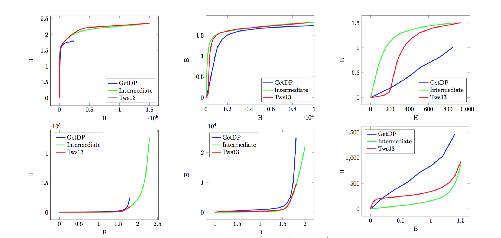

We can observe the relation given in GetDP is the smoothest one.
For the $$\Sigma-\Phi$$ case, we only have one twist in the whole curve and the Team Workshop one provide two twists.

We use extrapolation to extend the magnetic permeability when $$\mathbf{H}$$ goes to infinity. 

== Inputs

The source term - $$\mathbf{J}$$ - is generated solving a Laplacian in each half coils.
We present here a top view of an half of the coil.

image:half_coil.png[alt="half coil", caption="Figure 3."]

The gradient of the solution of each problems is multiplied with the number of Ampère Turns we want.

$$
\begin{aligned}
    -\Delta u &= 0\\
    \left.  u\right|_{\Gamma+} &= 1\\
    \left.  u\right|_{\Gamma-} &= 0\\
    \mathbf{J} &= At \frac{\nabla u}{\|\nabla u \|}
\end{aligned}
$$

== Outputs

We will compare the various fluxes the Team Workshop 13 Benchmark present and check the convergence in respect with various parameters:

- the formulation: saddle or stabilized,
- the current density
- the non linear formulation
- the $$\mu$$ discretization ($$P_1$$, $$P_2$$),
- the non linear relation.

== Behavior

Here are the meshes and spaces specifications

|===
|  | Number of elements | Number of Dof $$\mathbb{A}$$ | Number of Dof $$p$$ | Total
| **mesh 1** | 634 850 | 741 168 | 106 772 | 847 940  
| **mesh 2** | 4 070 302 | 4 748 125 | 679 348 | 5 427 473 
|===

Every simulation has run over 48 processors on **irma-atlas**.

=== GetDP non linear curve

We begin with the smoothiest $$B-H$$ relation.
At very low current density, both formulations (saddle, regularized), both algorithms (Picard, Polarization) with the two kinds of $$\mu$$ discretizaion converge. 

Here we show that the polarization method is not robust against high density current.

==== Mesh 1

|===
500 AT - Picard
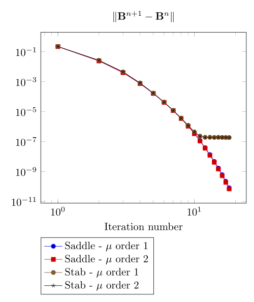  |
500 AT - Picard
image:mesh-1-AT-500-algo-0-mod-inductor3d-feel_time.png[] |
500 AT - Polarization
image:mesh-1-AT-500-algo-1-mod-inductor3d-feel.png[] |
500 AT - Polarization
image:mesh-1-AT-500-algo-1-mod-inductor3d-feel_time.png[] 
|
1000 AT - Picard
image:mesh-1-AT-1000-algo-0-mod-inductor3d-feel.png[] |
1000 AT - Picard
image:mesh-1-AT-1000-algo-0-mod-inductor3d-feel_time.png[] |
1000 AT - Polarization
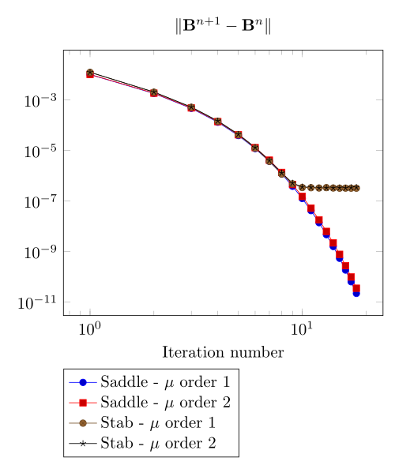 |
1000 AT - Polarization
image:mesh-1-AT-1000-algo-1-mod-inductor3d-feel_time.png[]
|
2000 AT - Picard
image:mesh-1-AT-2000-algo-0-mod-inductor3d-feel.png[] |
2000 AT - Picard
image:mesh-1-AT-2000-algo-0-mod-inductor3d-feel_time.png[] |
2000 AT - Polarization
image:mesh-1-AT-2000-algo-1-mod-inductor3d-feel.png[] |
2000 AT - Polarization
image:mesh-1-AT-2000-algo-1-mod-inductor3d-feel_time.png[]
|
3000 AT - Picard
image:mesh-1-AT-3000-algo-0-mod-inductor3d-feel.png[]|
3000 AT - Picard
image:mesh-1-AT-3000-algo-0-mod-inductor3d-feel_time.png[] |
3000 AT - Polarization
image:mesh-1-AT-3000-algo-1-mod-inductor3d-feel.png[] |
3000 AT - Polarization
image:mesh-1-AT-3000-algo-1-mod-inductor3d-feel_time.png[]
|===

At first, we can observe 
- the Polarization method does not handle the hight current density,
- the regularized formulation is always faster,
- the saddle point formulation is always more accurate,
- the $$\mu$$ space discretization has a little impact in the convergence.

==== Mesh 2

|===
500 AT - Picard
image:mesh-2-AT-500-algo-0-mod-inductor3d-feel.png[] |
500 AT - Picard
image:mesh-2-AT-500-algo-0-mod-inductor3d-feel_time.png[] |
500 AT - Polarization
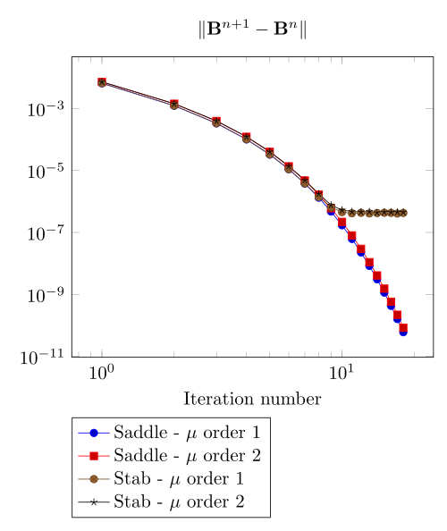 |
500 AT - Polarization
image:mesh-2-AT-500-algo-1-mod-inductor3d-feel_time.png[]
|
1000 AT - Picard
image:mesh-2-AT-1000-algo-0-mod-inductor3d-feel.png[] |
1000 AT - Picard
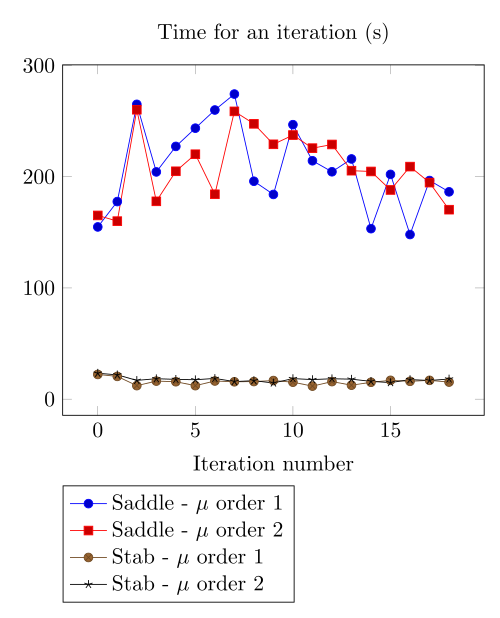 |
1000 AT - Polarization
image:mesh-2-AT-1000-algo-1-mod-inductor3d-feel.png[] |
1000 AT - Polarization
image:mesh-2-AT-1000-algo-1-mod-inductor3d-feel_time.png[]
|
2000 AT - Picard
image:mesh-2-AT-2000-algo-0-mod-inductor3d-feel.png[] |
2000 AT - Picard
image:mesh-2-AT-2000-algo-0-mod-inductor3d-feel_time.png[] |
2000 AT - Polarization
image:mesh-2-AT-2000-algo-1-mod-inductor3d-feel.png[] | 
2000 AT - Polarization
image:mesh-2-AT-2000-algo-1-mod-inductor3d-feel_time.png[]
|
3000 AT - Picard
image:mesh-2-AT-3000-algo-0-mod-inductor3d-feel.png[] |
3000 AT - Picard
image:mesh-2-AT-3000-algo-0-mod-inductor3d-feel_time.png[] |
3000 AT - Polarization
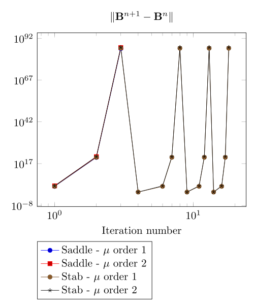 |
3000 AT - Polarization
image:mesh-2-AT-3000-algo-1-mod-inductor3d-feel_time.png[]
|===

Increasing the dof density does not improve here the convergence of failling method.

===  Intermediate non linear curve

==== Mesh 1

|===
500 AT - Picard
image:mesh-1-AT-500-algo-0-mod-sigma-phi.png[] | 
500 AT - Picard
image:mesh-1-AT-500-algo-0-mod-sigma-phi_time.png[] | 
500 AT - Polarization
image:mesh-1-AT-500-algo-1-mod-sigma-phi.png[] | 
500 AT - Polarization
image:mesh-1-AT-500-algo-1-mod-sigma-phi_time.png[] 
| 
1000 AT - Picard
image:mesh-1-AT-1000-algo-0-mod-sigma-phi.png[] | 
1000 AT - Picard
image:mesh-1-AT-1000-algo-0-mod-sigma-phi_time.png[] | 
1000 AT - Polarization
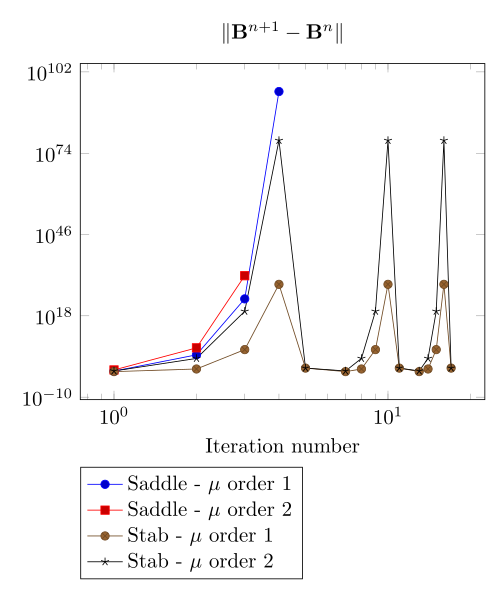 | 
1000 AT - Polarization
image:mesh-1-AT-1000-algo-1-mod-sigma-phi_time.png[] 
| 
2000 AT - Picard
image:mesh-1-AT-2000-algo-0-mod-sigma-phi.png[] | 
2000 AT - Picard
image:mesh-1-AT-2000-algo-0-mod-sigma-phi_time.png[] | 
2000 AT - Polarization
image:mesh-1-AT-2000-algo-1-mod-sigma-phi.png[] | 
2000 AT - Polarization
image:mesh-1-AT-2000-algo-1-mod-sigma-phi_time.png[] 
| 
3000 AT - Picard
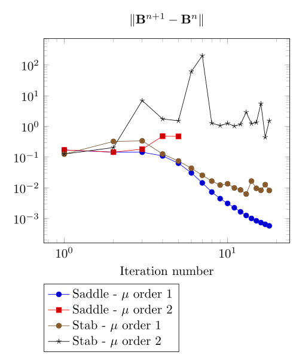 | 
3000 AT - Picard
image:mesh-1-AT-3000-algo-0-mod-sigma-phi_time.png[] | 
3000 AT - Polarization
image:mesh-1-AT-3000-algo-1-mod-sigma-phi.png[] | 
3000 AT - Polarization
image:mesh-1-AT-3000-algo-1-mod-sigma-phi_time.png[] 
|=== 

==== Mesh 2

|=== 
500 AT - Picard
image:mesh-2-AT-500-algo-0-mod-sigma-phi.png[] | 
500 AT - Picard
image:mesh-2-AT-500-algo-0-mod-sigma-phi_time.png[] | 
500 AT - Polarization
image:mesh-2-AT-500-algo-1-mod-sigma-phi.png[] | 
500 AT - Polarization
image:mesh-2-AT-500-algo-1-mod-sigma-phi_time.png[] 
| 
1000 AT - Picard
image:mesh-2-AT-1000-algo-0-mod-sigma-phi.png[] | 
1000 AT - Picard
image:mesh-2-AT-1000-algo-0-mod-sigma-phi_time.png[] | 
1000 AT - Polarization
image:mesh-2-AT-1000-algo-1-mod-sigma-phi.png[] | 
1000 AT - Polarization
image:mesh-2-AT-1000-algo-1-mod-sigma-phi_time.png[] 
| 
2000 AT - Picard
image:mesh-2-AT-2000-algo-0-mod-sigma-phi.png[] | 
2000 AT - Picard
image:mesh-2-AT-2000-algo-0-mod-sigma-phi_time.png[] | 
2000 AT - Polarization
image:mesh-2-AT-2000-algo-1-mod-sigma-phi.png[] | 
2000 AT - Polarization
image:mesh-2-AT-2000-algo-1-mod-sigma-phi_time.png[] 
| 
3000 AT - Picard
image:mesh-2-AT-3000-algo-0-mod-sigma-phi.png[] | 
3000 AT - Picard
image:mesh-2-AT-3000-algo-0-mod-sigma-phi_time.png[] | 
3000 AT - Polarization
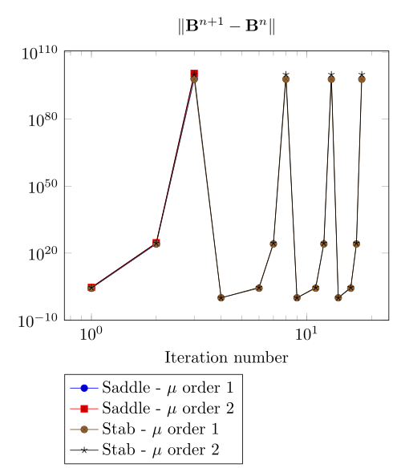 | 
3000 AT - Polarization
image:mesh-2-AT-3000-algo-1-mod-sigma-phi_time.png[] 
|=== 

=== TEAM Workshop 13 non linear curve

We have observed with the getDP relation the polarization method is not robust.
We have observed with the $$\Sigma-\Phi$$ relation the regularity of the relation can be a bottleneck.

Here, we show the team Workshop 13 $$B-H$$ relation provide us - at best - non fully convergent simulations and only saddle-point formulation with picard algorithm can be run.

==== Mesh 1

|===
500 AT - Picard
image:mesh-1-AT-500-algo-0-mod-tws.png[] | 
500 AT - Picard
image:mesh-1-AT-500-algo-0-mod-tws_time.png[] | 
500 AT - Polarization
image:mesh-1-AT-500-algo-1-mod-tws.png[] | 
500 AT - Polarization
image:mesh-1-AT-500-algo-1-mod-tws_time.png[] 
| 
1000 AT - Picard
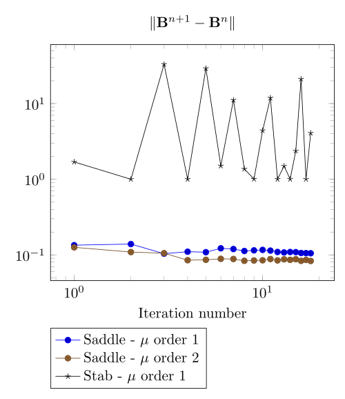 | 
1000 AT - Picard
image:mesh-1-AT-1000-algo-0-mod-tws_time.png[] | 
1000 AT - Polarization
image:mesh-1-AT-1000-algo-1-mod-tws.png[] | 
1000 AT - Polarization
image:mesh-1-AT-1000-algo-1-mod-tws_time.png[] 
| 
2000 AT - Picard
image:mesh-1-AT-2000-algo-0-mod-tws.png[] | 
2000 AT - Picard
image:mesh-1-AT-2000-algo-0-mod-tws_time.png[] | 
2000 AT - Polarization
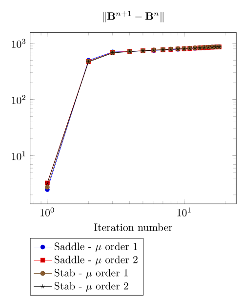 | 
2000 AT - Polarization
image:mesh-1-AT-2000-algo-1-mod-tws_time.png[] 
| 
3000 AT - Picard
image:mesh-1-AT-3000-algo-0-mod-tws.png[] | 
3000 AT - Picard
image:mesh-1-AT-3000-algo-0-mod-tws_time.png[] | 
3000 AT - Polarization
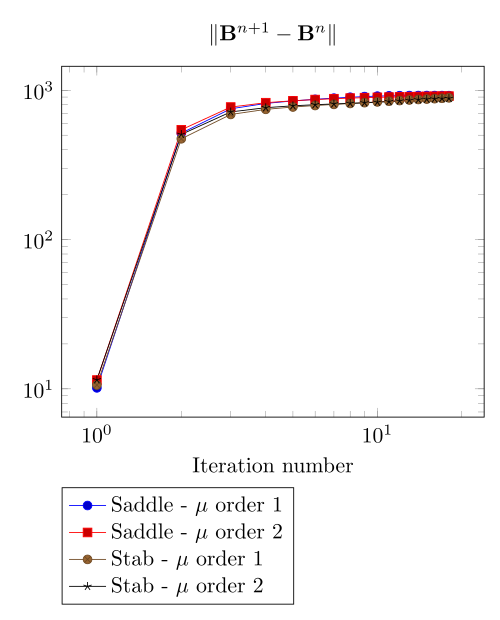 | 
3000 AT - Polarization
image:mesh-1-AT-3000-algo-1-mod-tws_time.png[] 
|=== 

==== Mesh 2

|===
500 AT - Picard
image:mesh-2-AT-500-algo-0-mod-tws.png[] | 
500 AT - Picard
image:mesh-2-AT-500-algo-0-mod-tws_time.png[] | 
500 AT - Polarization
image:mesh-2-AT-500-algo-1-mod-tws.png[] | 
500 AT - Polarization
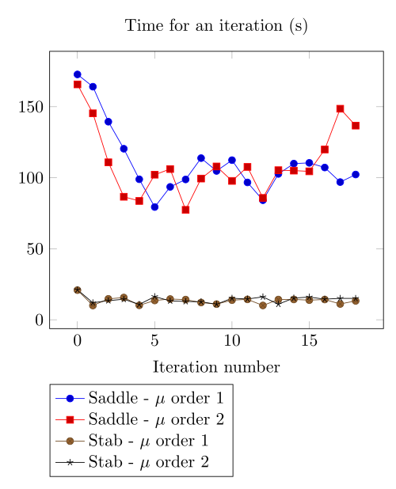 
| 
1000 AT - Picard
image:mesh-2-AT-1000-algo-0-mod-tws.png[] | 
1000 AT - Picard
image:mesh-2-AT-1000-algo-0-mod-tws_time.png[] | 
1000 AT - Polarization
image:mesh-2-AT-1000-algo-1-mod-tws.png[] | 
1000 AT - Polarization
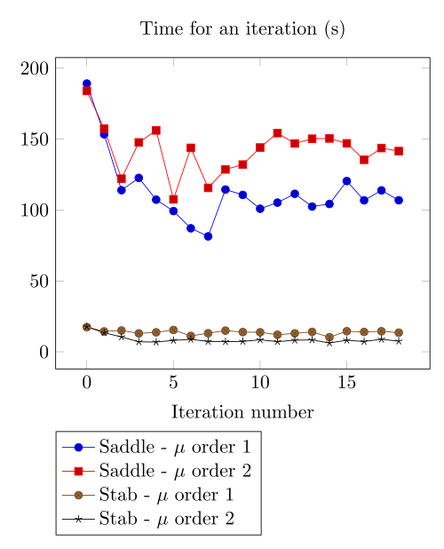 
| 
2000 AT - Picard
image:mesh-2-AT-2000-algo-0-mod-tws.png[] | 
2000 AT - Picard
image:mesh-2-AT-2000-algo-0-mod-tws_time.png[] | 
2000 AT - Polarization
image:mesh-2-AT-2000-algo-1-mod-tws.png[] | 
2000 AT - Polarization
image:mesh-2-AT-2000-algo-1-mod-tws_time.png[] 
| 
3000 AT - Picard
image:mesh-2-AT-3000-algo-0-mod-tws.png[] | 
3000 AT - Picard
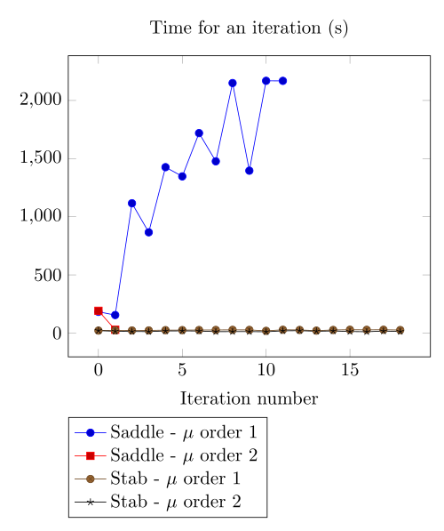 | 
3000 AT - Polarization
image:mesh-2-AT-3000-algo-1-mod-tws.png[] | 
3000 AT - Polarization
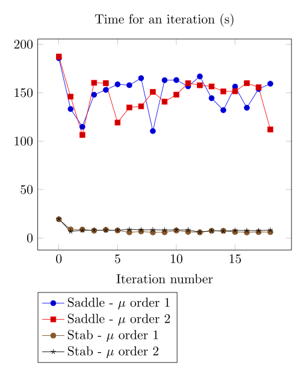 
|=== 

== Comparision with Team Workshop 13

|===
1000 AT - Mesh 1 - Saddle
image:tws13_saddle_1_1000.png[] |
1000 AT - Mesh 2 - Saddle
image:tws13_saddle_2_1000.png[]
|
1000 AT - Mesh 1 - Regularized
image:tws13_stab_1_1000.png[] |
1000 AT - Mesh 2 - Regularized
image:tws13_stab_2_1000.png[]
|
3000 AT - Mesh 1 - Saddle
image:tws13_saddle_1_3000.png[] |
3000 AT - Mesh 2 - Saddle
image:tws13_saddle_2_3000.png[]
|
3000 AT - Mesh 1 - Regularized
image:tws13_stab_1_3000.png[] |
3000 AT - Mesh 2 - Regularized
image:tws13_stab_2_3000.png[]
|===
== Remarks

**Polarization or Picard ? **

At first, we can be dispointed with the very small advantage the Polarization method provide considering the computing time.
It has to be higlighted the `update()` method - for the non linear right hand side or the magnetic permeability - has an effect on the magnetic concrete.
As long as the ratio of magnetic concrete volume in the whole volume of computation is always little, we are not surprised to face a very little improvement in the method.
Actually, rebuilding the preconditioner does seem to be that time consuming.

**Saddle or Regularizd ? **

Considering our results, we recommend the following strategy:
- run the regularized formulation until a stationnary point is found,
- use the current $$\mathbb{A}$$ as an initial guess for the saddle point method.

**$$\mu$$ discretization**

Our calculus has not shown a sufficient difference to definitely chose.

== Propositions

Here the ideas we do not have time to test.

=== Polarization

The polarization generate a right hand side that can present huge variations - see the $$B-H$$ curve for $$B \approx 1.8$$ for example.
In the present geometry, the maximum of $$B$$ is achieved at the boundary of the ferromagnetic concrete.
That is the non linear right hand side is discontinuous along the boundary of the ferromagnetic concrete, with a huge variation.
We recommend to test the $$L_2$$ projection of the non linear right hand side in the whole domain to smooth it, with a smoothing parameter decreasing with the iterations to decrease the effect of this projection.

=== Continuity

Considering the convergence is mainly linked to the current density, a contiuation algorithm has to be testesd.

=== Mixing Polarization and Picard.

The Polarization method reads:
$$
B = \mu_{opt} H + I
$$
where the picard method reads:
$$
B = \mu_0 \mu_r H
$$
The idea we propose is to write:
$$
\begin{aligned}
B^{(n)} &= \mu_{opt} H ^{(n)} + I^{(n)} \\
        &= \mu_0 \mu_r^{(n)} H^{(n)}
\end{aligned}
$$
That is:
$$
\mu_r^{(n)} = \frac{\mu_{opt}}{\mu_0} + \frac{1}{\mu_0 H^{(n)}} I^{(n)}
$$

That is we can transfert the non linearity from the right hand side to the matrix whenever we have to.
